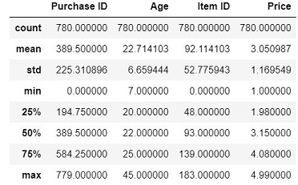
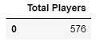
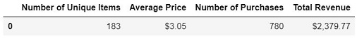
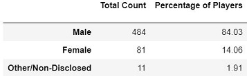
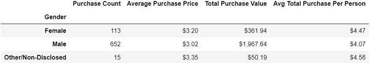
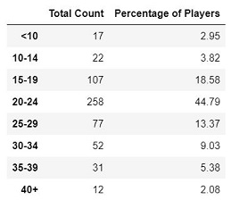
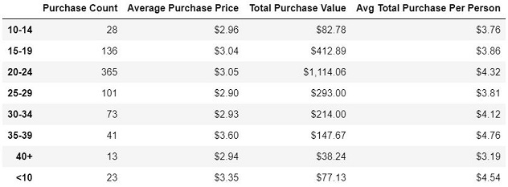
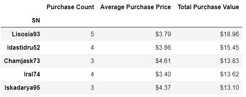
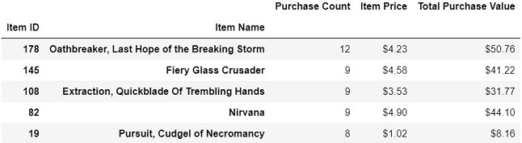
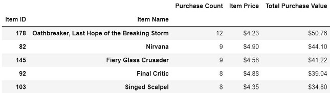

# Analysis for Heroes of Pymoli

In this project, I am analyzing data to communicate useful insights about a fantasy games called Heroes of Pymoli. The dataset contains various purchasing data, such as the age and gender of buyers, among others. It can be accessed at [purchase_data.csv](Resources/purchase_data.csv).

## Technologies Used
   * Pandas
   * Numpy

## Summary of Steps and relevant Outputs
  1. **Reading and Storing the dataset into a Dataframe**

  2. **Doing a statistical analysis of the dataset:** The purpose of this step is to study the dataset with quick statistics
  
  

  3. **Player Count:**  Finding a unique count of Players as some players had more than 1 purchase
  
  

  4. **Overall Purchasing Analysis:** Doing an overall purchasing Analysis
  
  

  5. **Gender Demographics:** Finding Count and Percentage of Players by Gender 
  
  

  6. **Purchasing Analysis by Gender:** Doing an overall purchasing Analysis by Gender
  
  

  7. **Age Demographics:** After establishing bins for the ages of playes, I came up with the below output
  
  

  8. **Purchasing Analysis by Age Group:** Leveraging Bins created, I came up with the following outputs
  
  

  9. **Top Spenders:** Identifying the the top 5 spenders and sorting in descending order
  
  

  10. **Most Popular Items:** Identifying the 5 most popular items by purchase count
  
  

  11. **Most Profitable Items:** Identifying the 5 most profitable items by total purchase value
  
  

## Conclusions
Based on the analysis, I see 3 main insights, which are listed at: [Observable_Trends.docx](Observable_Trends.docx).
